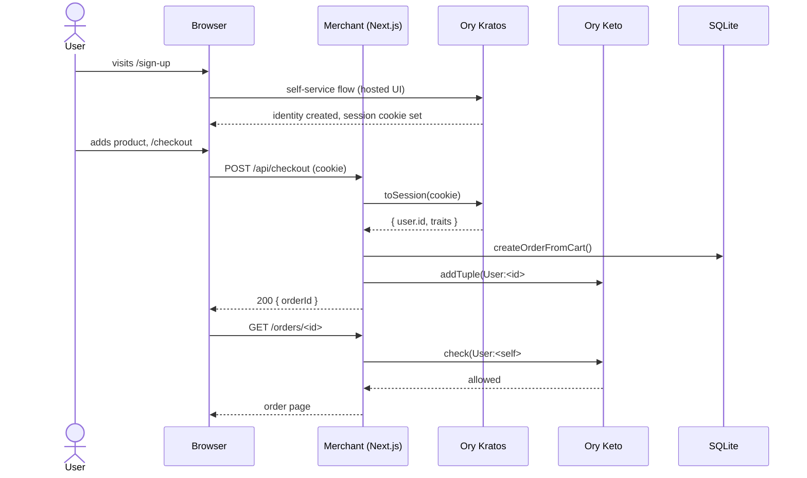
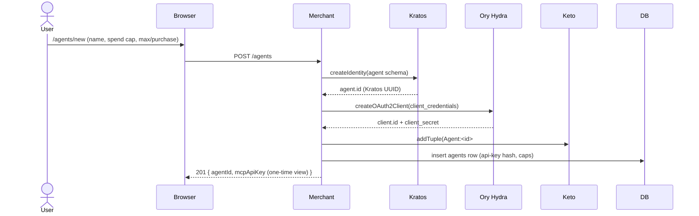
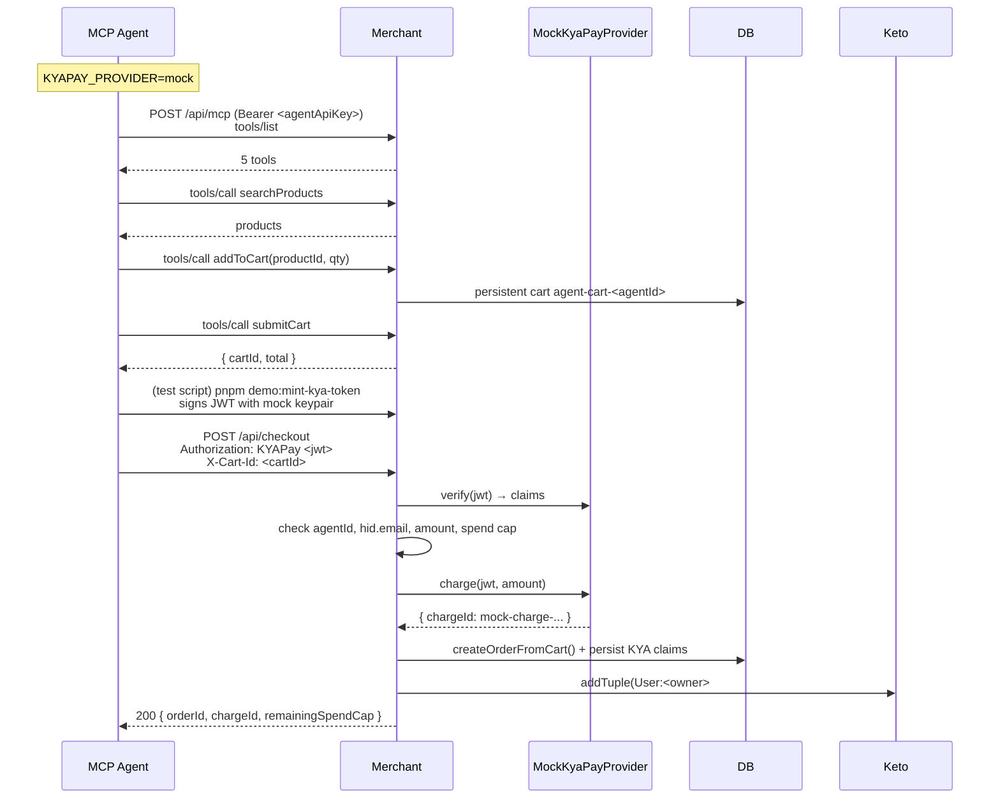
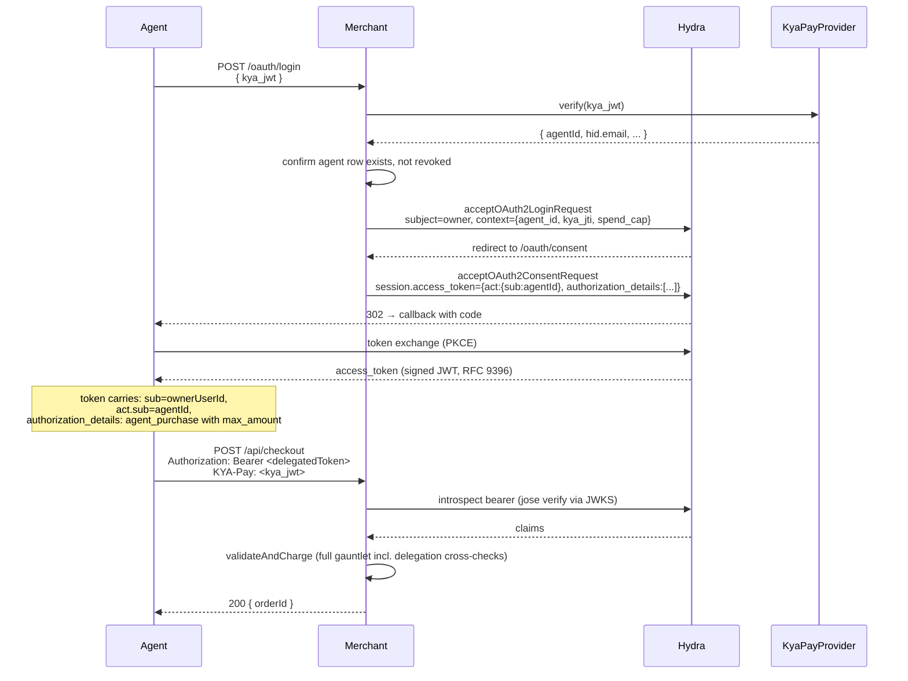
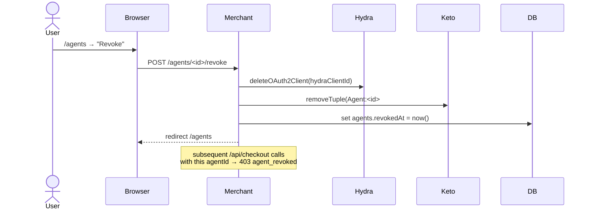
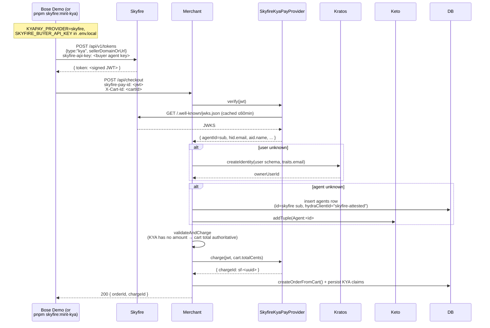
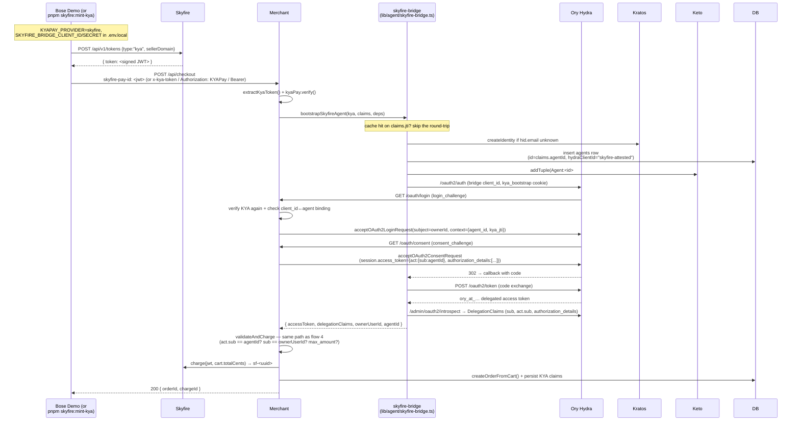

# Merchant Agentic Demo

A reference integration showcasing **Ory** (identity, OAuth2, permissions) and **Skyfire KYAPay** (agent payments) on a generic merchant storefront. Built for Ory by Ory.

> Status: Phases 0–10 shipped on `main`. Real Skyfire is wired (mock remains the default). The headline flow ([Flow 7](#flow-7--combined-skyfire--ory-headline-demo-phase-10)) takes a Bose-style Skyfire KYA from a cold browser to a Hydra-delegated access token, exercising Kratos identity creation, Keto ownership, and Hydra delegation in a single round-trip. See `docs/plans/2026-05-13-architecture-and-roadmap.md` for the roadmap and `docs/plans/phases/` for per-phase plans.

## Demoable flows

Seven flows work end-to-end against `pnpm dev` today. Flows 1–5 require no external accounts beyond the configured Ory Network project. Flows 6–7 additionally require Skyfire creds (and Flow 7 needs the `skyfire-bridge` Hydra client — provisioned by `./scripts/ory-setup/hydra-config.sh`).

| # | Flow | What it shows | Skyfire needed? |
|---|---|---|---|
| 1 | Human signup → browse → checkout (stub pay) | Ory Kratos session, Keto-gated order viewing | No |
| 2 | Human registers an agent at `/agents/new` | Ory creates Kratos agent identity + Hydra OAuth client; Keto ownership tuple | No |
| 3 | MCP agent buys with mock KYA | Agent API-key auth, KYA verification, mandate-panel rendering | No |
| 4 | Hydra delegated-token bootstrap (KYA → access token w/ `act` + `authorization_details`) | RFC 9396 delegated authorization wired through Ory Hydra | No |
| 5 | Agent revocation from `/agents` | Hydra client revoke + Keto tuple remove + `revokedAt` stamp | No |
| 6 | Real Skyfire KYA → auto-provision + charge | _Building block for Flow 7._ JWKS-local verify, auto-create user + agent from Skyfire-attested identity | **Yes** |
| **7** | **Combined Skyfire + Ory (headline demo)** | **KYA → auto-provision → Hydra delegated token → charge, all in one inline server-side step. Exercises Kratos, Keto, and Hydra together from a single Bose-style request.** | **Yes** |

### Flow 1 — Human signup → checkout



### Flow 2 — Human registers an agent



### Flow 3 — MCP agent buys with mock KYA



### Flow 4 — Hydra delegated-token bootstrap (Phase 7)



### Flow 5 — Agent revocation



### Flow 6 — Real Skyfire KYA → auto-provision + charge (Phase 8+9 — building block)

> _This is the underlying building block; [Flow 7](#flow-7--combined-skyfire--ory-headline-demo-phase-10) is the demo headline. Flow 6 alone produces a kyapay order but does **not** mint a Hydra delegated token — useful for "Skyfire-only, no Hydra" deployments or for understanding the auto-provision half of Flow 7 in isolation._



### Flow 7 — Combined Skyfire + Ory (headline demo, Phase 10)

The penultimate demo flow. A single Bose-style `/api/checkout` request, carrying only a Skyfire KYA, drives every Ory product (Kratos auto-provision, Keto ownership tuple, Hydra delegated access token with RFC 9396 `authorization_details`) plus Skyfire settlement, server-side, in one round-trip. No prior user or agent registration required. See `docs/plans/phases/phase-10-combined-skyfire-delegation.md` for the design.



If `SKYFIRE_BRIDGE_CLIENT_ID/SECRET` aren't configured, `/api/checkout` falls back to Flow 6 behavior (plain auto-provision, no delegated token) so the demo doesn't collapse during early setup. Look for `[checkout] skyfire-bridge bootstrap failed` in the dev log if you expected delegation but got the fallback.

---

## Stack

Next.js 16 (App Router) · React 19 · Tailwind v4 · shadcn/ui · Drizzle + SQLite · Vitest · Playwright · Ory Kratos (sessions) · Ory Keto (permissions) · Ory Network · Skyfire KYAPay (Phase 8+)

## Prereqs

- Node 25.9.0 (pinned via `.node-version`; install via fnm/nvm)
- pnpm 11+
- `ory` CLI installed and authed (`brew install ory/tap/cli && ory auth`)

## Setup

### 1. Install + env

```bash
pnpm install
cp .env.example .env.local
```

Edit `.env.local`:

- `ORY_ADMIN_API_KEY` — create in the Ory console (Project Settings → API Keys). Required for admin operations (agent identity creation, e2e test-user provisioning, Hydra client management).
- `ORY_SDK_URL` — see the **Ory Tunnel** section below. Defaults to the project's `oryapis.com` URL, but for browser sign-in on localhost you must change this to `http://localhost:4000`.

### 2. Database

```bash
pnpm db:migrate
pnpm db:seed
```

### 3. Ory project configuration

The Ory project (`f5798507-b1c0-4168-9fd8-7eeb7a40d75c`, name `SkyfireOryDemo`) is **already configured**; testers don't need to touch it. The source of truth lives in `scripts/ory-setup/`:

- `identity-schemas/user.schema.json` + `agent.schema.json` — Kratos schemas
- `keto-namespaces/namespaces.ts` — Keto OPL
- `hydra-config.sh` — Hydra Login/Consent URLs (must point at `http://localhost:4000/oauth/login` + `/oauth/consent` when running via the tunnel; **not** at `http://localhost:3000` directly — that breaks the cookie domain)
- `return-urls.sh` — Account Experience post-login redirect URLs

To re-apply config (project owner only):

```bash
./scripts/ory-setup/apply.sh
```

`apply.sh` is idempotent; existing identities and tuples are preserved.

## Run (REQUIRED: Ory Tunnel)

Sign-in is hosted by **Ory Account Experience**. The hosted UI sets its session cookie on `*.oryapis.com`, which a browser will **not** send back to `http://localhost:3000`. Without the tunnel you'll hit one of these symptoms:

- Sign-in succeeds, but every subsequent page redirects back to `/login` (no session cookie reaching the app)
- After several redirect-loop iterations, Ory's edge rate-limits you and the browser shows **`ERR_CONNECTION_REFUSED`** or **`429 Too Many Requests`**

The **Ory Tunnel** proxies Ory under `http://localhost:4000` so the Kratos cookie is set on `localhost` and shared with the app on `:3000`.

```bash
# Terminal 1 — the app
pnpm dev                # http://localhost:3000

# Terminal 2 — the tunnel (must stay running)
ory tunnel --project f5798507-b1c0-4168-9fd8-7eeb7a40d75c http://localhost:3000
# Now http://localhost:4000 fronts Ory (Kratos public + Hosted UI)
```

Then in `.env.local`, point the SDK at the tunnel:

```
ORY_SDK_URL=http://localhost:4000
```

Restart `pnpm dev` after changing `.env.local`. Browse to `http://localhost:3000` (not `:4000` — only the tunnel is on `:4000`); the app will redirect you through the tunnel for sign-in and back, with the session cookie now landing on `localhost`.

### Cookie name (project-agnostic)

Ory Network sets the browser session cookie as `ory_session_<slug>` where `<slug>` is your project's hostname prefix with hyphens stripped — for SkyfireOryDemo it's `ory_session_eagerdhawanmio9f9ilcu`. The merchant's middleware and `OrySessionProvider` discover this by matching any cookie named `ory_kratos_session` *or* starting with `ory_session_`, so you can point this codebase at any Ory Network project without changing code. (Self-hosted Kratos sets `ory_kratos_session` by default, also matched.)

### Troubleshooting browser sign-in

| Symptom | Cause | Fix |
|---|---|---|
| `ERR_CONNECTION_REFUSED` after submitting sign-in form | Redirect loop got rate-limited by Ory's edge | Start `ory tunnel` (above) and set `ORY_SDK_URL=http://localhost:4000` |
| `429 Too Many Requests` from `*.oryapis.com` | Same as above | Same as above; wait a few minutes for the rate-limit window to reset |
| `ERR_TOO_MANY_REDIRECTS` between `/login` ↔ `/auth/callback` even with tunnel running | Stale clone where `getCurrentSession` only looked for `ory_kratos_session`, missing Ory Network's `ory_session_<slug>` | Pull latest `main` — `OrySessionProvider` now matches by prefix |
| Signed in but `/me`, `/orders`, `/checkout` redirect back to `/login` | Session cookie not reaching the app (cross-domain) | Confirm tunnel is running and `ORY_SDK_URL` points at `:4000`, then sign in again |
| Tunnel command exits immediately with `ory: command not found` | CLI not installed | `brew install ory/tap/cli && ory auth` |

The e2e suite (`pnpm test:e2e`) does **not** need the tunnel — it uses session-token injection via the admin API; see `e2e/fixtures/test-identity.ts`.

## Other commands

```bash
pnpm test                # Vitest unit tests
pnpm test:e2e            # Playwright e2e (no tunnel required)
pnpm exec tsc --noEmit   # Typecheck
pnpm lint                # ESLint
```

## Sign in

Anonymous browsing works without an account. To check out (or visit `/cart`, `/orders`, or `/me`), you must sign in via the hosted Account Experience — which, on localhost, **requires the Ory Tunnel** to be running (see above).

### Test users for e2e

The e2e suite (`pnpm test:e2e`) creates throwaway test identities via the Ory admin API and deletes them on teardown. Requires `ORY_ADMIN_API_KEY` (or `ORY_API_KEY`) set in `.env.local`.

## Permissions

Order ownership is enforced by **Ory Keto**. When a user places an order, two relation tuples are written via `getAuth().permission.addTuple()`:

- `Order:{id}#owner@User:{user_id}` — durable ownership
- `Order:{id}#view@User:{user_id}` — view permission (explicit; Ory Network's hosted Keto doesn't enforce OPL computed permits)

The order detail page calls `getAuth().permission.check({ namespace: "Order", object, relation: "view", subject })` before rendering. A different signed-in user gets a Forbidden page; an anonymous visitor gets redirected to /login by middleware.

A small **Debug Policy Panel** appears at the bottom-right of pages that perform Keto checks (click to expand). Each entry shows: ALLOW/DENY · namespace:object#relation@subject · latency in ms. Great for demo storytelling.

The OPL namespaces live in `scripts/ory-setup/keto-namespaces/namespaces.ts` and the names are registered by `scripts/ory-setup/keto-config.sh`. (The TypeScript `permits.view = (ctx) => ...` rule in the OPL is informational — Ory Network only enforces direct relation tuples.)

If you ever need to backfill tuples for orders in the DB that pre-date Phase 3, run `pnpm backfill:tuples`.

## Agents

Signed-in users can register AI agents at `/me/agents/new`. Each registered agent is a real entity in three places:

- **Kratos** — a separate identity using the agent schema (traits: `owner_identity_id`, `agent_type`, `display_name`).
- **Hydra** — an OAuth2 client (`grant_types: ["client_credentials"]` for Phase 4; Phase 7 adds device-code grant).
- **Keto** — an `Agent:{aid}#owner@User:{uid}` tuple.

The local DB (`agents` table) denormalizes display name, agent type, spend cap, expiry, and revocation timestamp for fast lookups.

Revoking an agent invalidates the Hydra OAuth2 client, deletes the Keto tuple, and stamps the local row's `revoked_at`. The Kratos identity is kept for audit.

Future: Phase 6 binds agents to Skyfire KYA Pay credentials; Phase 7 wires the Hydra Login/Consent flow so a KYA token can be exchanged for a delegated user-bound access token.

## Agent surfaces

The merchant exposes two ways for agents to shop:

1. **MCP server** at `POST /api/mcp` — JSON-RPC 2.0. Tools: `searchProducts`, `getProduct`, `addToCart`, `viewCart`, `submitCart`. Requires `Authorization: Bearer <hydra-access-token>` (mint via `pnpm demo:mint-agent-token` against a Hydra OAuth2 client).
2. **HTML checkout with `X-KYA-Token` header** (Bose-style) — `POST /api/checkout` accepts an `X-KYA-Token: <jwt>` header in lieu of the human user-session flow. Walks the same HTML site a human would.

Both surfaces converge on `lib/agent/validate-and-charge.ts`. In Phase 5, that stub returns **`HTTP 402 Payment Required`** with `WWW-Authenticate: KYAPay realm="merchant-agentic-demo"`. Phase 6 will wire real KYA token validation + Skyfire `chargeToken`.

### Try it locally

```bash
# Terminal 1
pnpm dev

# Terminal 2 — first create a Hydra OAuth2 client via the Ory dashboard
# (grant_types: ["client_credentials"]) and put the id+secret in .env.local:
#   DEMO_AGENT_CLIENT_ID=...
#   DEMO_AGENT_CLIENT_SECRET=...
AGENT_TOKEN=$(pnpm demo:mint-agent-token | tail -1) pnpm demo:agent-mcp
# or:
pnpm demo:agent-browser
```

Both demos should report `received expected 402`.

## KYA Pay (Phase 6 — mock Skyfire)

Phase 6 wires real KYA token verification + a mock Skyfire `chargeToken`. Order details show a **Mandate panel** when payment was via KYAPay.

### Setup

```bash
pnpm gen:mock-skyfire-keys
# Paste both lines into .env.local. DO NOT commit the private key.
```

### Demo flow

```bash
# Terminal 1: dev server
pnpm dev

# Terminal 2: register an agent via /me/agents UI (note its id)
# Then mint a Hydra access token for the demo OAuth2 client and run:
AGENT_TOKEN=$(pnpm demo:mint-agent-token | tail -1) \
  pnpm demo:agent-mcp --agent <agent-id> --user-email <your-email>
```

The MCP demo agent lists tools, browses, adds to cart, views cart, mints a KYA token for the exact cart total, submits, and gets HTTP 200 + an order id. Visit `/orders/<id>` to see the Mandate panel.

### Validation matrix

| Failure | Status | `error` |
|---|---|---|
| Bad signature / expired / wrong audience | 400 | `kya_invalid` |
| Amount doesn't match cart total | 400 | `amount_mismatch` |
| `hid.email` doesn't match user | 403 | `hid_mismatch` |
| `aid.id` doesn't match agent context | 403 | `aid_mismatch` |
| Amount exceeds spend cap | 403 | `spend_cap_exceeded` |
| Replay (same `jti` charged twice) | 402 | `charge_failed` |

Phase 8 swaps `MockKyaPayProvider` for `SkyfireKyaPayProvider`. The merchant code doesn't change — `getPayments()` reads `KYAPAY_PROVIDER` and returns the right impl.

## KYA Pay (Phase 8 — real Skyfire)

Set in `.env.local`:

```
KYAPAY_PROVIDER=skyfire
SKYFIRE_BUYER_API_KEY=<your buyer agent api key>
# optional overrides:
# SKYFIRE_JWKS_URL=https://app.skyfire.xyz/.well-known/jwks.json
# SKYFIRE_ISSUER=https://app.skyfire.xyz
# SKYFIRE_API_BASE=https://api.skyfire.xyz/api/v1
# SKYFIRE_EXPECTED_AUDIENCE=<seller agent id, if you want strict aud enforcement>
```

Mint a real KYA token for manual /charge testing:

```bash
pnpm skyfire:mint-kya --sellerDomain http://localhost:3000
# prints the JWT to stdout
```

Real Skyfire KYA tokens carry identity only (no `amount`/`cur`). The merchant uses the cart total as the charge amount; identity verification (`hid.email` matches the owner, `sub` matches the bound agent) still gates the charge.

Settlement is currently a synthetic `sf-*` chargeId. Real Skyfire settlement uses `pay` / `kya-pay` tokens — a future phase.

### Phase 9 — embedded-browser KYA + auto-provision

For embedded-browser agents (e.g. Skyfire's Bose/Visa demo), the merchant accepts the KYA token via the `skyfire-pay-id` request header on `/api/checkout`. No prior agent or user registration is required:

- If `hid.email` doesn't match a local user → a Kratos identity is created (`createUser`).
- If `claims.agentId` (Skyfire's `sub`) doesn't match a local `agents` row → one is inserted with `id = claims.agentId`, owner = the (now-existing) user, no spend cap, no per-purchase max. Keto tuple `Agent:<id>#owner@User:<ownerId>` is written.

Subsequent requests with the same KYA token are idempotent — existing rows are reused. Auto-provisioning only fires on the agent-checkout path (no Hydra bearer present); the Phase 7 delegated-token flow continues to require pre-registered agents.

Accepted KYA header sources (in priority order): `skyfire-pay-id`, `x-kya-token`, `Authorization: KYAPay <jwt>`.

## Delegated tokens (Phase 7)

Agents bootstrap a Hydra-issued user-bound access token from their KYA JWT instead of relying on static client credentials. The merchant authorizes purchases against the Hydra token's `act` (agent) + `sub` (user) + `authorization_details` claims; KYA settlement still flows through `kyaPay.charge()`.

### How it works

1. Agent mints a bootstrap KYA via `mintKyaToken` (helper exported from `lib/payments/mint.ts`).
2. Agent POSTs to `/api/oauth/agent-bootstrap` with `{ kya_jwt }`.
3. The merchant's orchestrator drives Hydra's `authorization_code` flow server-side:
   - Sets a `kya_bootstrap` cookie carrying the JWT.
   - Hits Hydra's `/oauth2/auth` endpoint and follows redirects through `/oauth/login` → `/oauth/consent` → callback.
   - Our **Login app** validates the KYA, looks up the agent + owner, calls `acceptOAuth2LoginRequest({subject, context})`.
   - Our **Consent app** auto-accepts with `act` + `authorization_details` (RFC 9396) written into `session.access_token`.
   - Exchanges the resulting code for an `ory_at_...` access token.
4. Agent uses the access token as Bearer for all subsequent MCP calls.
5. At `submitCart`, the agent passes a **fresh settlement KYA** matching the cart total. The merchant verifies it via mock Skyfire and charges.

### Why this matters

| Aspect | Phase 6 | Phase 7 |
|---|---|---|
| Agent identity to merchant | `client_credentials` token | Hydra-issued delegated token (with `act` claim) |
| User identity binding | DB lookup via agent.owner_user_id | `sub` claim in the Hydra token |
| Spending limit | local DB `spend_cap_cents` | also `authorization_details.max_amount` (snapshot at consent time) |
| KYA token's role | Agent presents on every request | One-shot bootstrap + per-charge settlement |

This is Ory's canonical delegation envelope — `sub`/`act`/`authorization_details` modeled on RFC 9396 and the spirit of RFC 8693 (even though Hydra doesn't natively support token-exchange).

### Try it

```bash
# Terminal 1
pnpm dev

# Terminal 2 — once a registered agent exists in the DB and DEMO_AGENT_CLIENT_* is set
pnpm demo:agent-mcp --agent <agent-id> --user-email <owner-email>
```

The script mints a bootstrap KYA, bootstraps a delegated token, drives MCP tool calls, mints a settlement KYA, and submits the cart. Visit `/orders/<id>` to see the Mandate panel.

### Notes & limitations

- The OAuth2 redirect-following uses a hand-rolled cookie jar inside `fetch` (`lib/oauth/bootstrap.ts`). Production should use a real OAuth2 client library.
- **Token hooks are silently dropped on Ory Network's hosted Hydra.** The `/api/token-hook` route exists for forward-compatibility with self-hosted Hydra. Spend-cap enforcement on the hosted demo lives entirely in `validateAndCharge`.
- Ory Network's hosted Hydra issues opaque tokens (`ory_at_...`) by default. We verify them via introspection (`/admin/oauth2/introspect`), not local JWT verification.

## Architecture & roadmap

- `docs/plans/2026-05-13-architecture-and-roadmap.md` — the master plan
- `docs/plans/phases/` — per-phase TDD implementation plans
- `docs/research/2026-05-13-research-summary.md` — research that informed the plan
- `docs/decisions.md` — ADRs

## Ory project

- Project ID: `f5798507-b1c0-4168-9fd8-7eeb7a40d75c`
- SDK URL: `https://eager-dhawan-mio9f9ilcu.projects.oryapis.com`
- Project name: SkyfireOryDemo
- Config-as-code: `scripts/ory-setup/`
